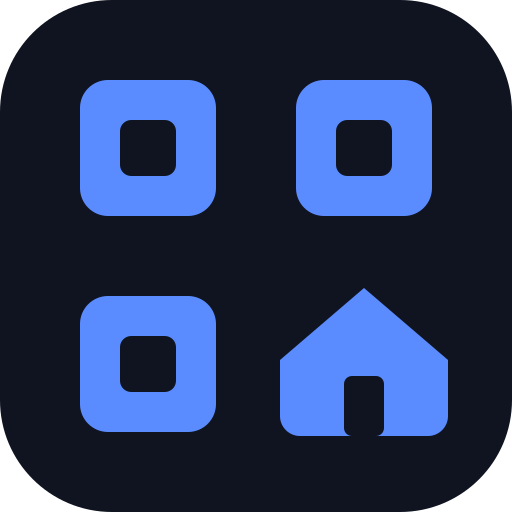

<p align="center"></p>

# MatterQR

A small self-hosted web app for keeping track of your **Matter smart-home
pairing codes**. Scan the QR code on a device (or its box) with your phone's
camera, give it a name and a room, and it's saved. You won't be digging
through the bin for the box when you need to re-pair it later.

## Features

- **Scan from your phone's browser.** Uses the native `BarcodeDetector` API
  where available, with a [jsQR](https://github.com/cozmo/jsQR) fallback
  (e.g. iOS Safari). Includes a viewfinder, torch toggle and zoom controls for
  small, dense codes.
- **Manual entry** of the numeric pairing code when there's no QR.
- **Re-display any saved code as a fresh, scannable QR**, so you can pair
  straight from the app.
- Device name, details (free-typed dropdown that learns as you go), room,
  notes and an optional photo (downscaled on the phone before upload).
- **Autosave.** A scan is stored as soon as it's captured.
- **Print** a per-room table of devices and codes.
- **Optional Google Drive backup**: zips the database and photos into a
  `MatterQR Backups` folder (keeps the last 20) whenever a device is added,
  plus a "Backup now" button.
- **Paired with**: record which smart-home systems (Apple Home, Google Home,
  Home Assistant, IKEA Home smart, etc.) each device has been added to, with
  dates and any permanent codes. Searchable and included in printouts.
- **Light, dark or auto** theme, remembered per browser.
- **Add to Home Screen** with a proper app icon on iPhone and Android.
- Single container, SQLite storage, and no external services needed at runtime.

## ⚠️ Security: read this first

**MatterQR has no login of its own.** Anyone who can reach it can read, edit
and delete every code. Your pairing codes are effectively the keys to your
smart-home devices, so:

- **Do not expose it directly to the internet.** Run it on your LAN only,
  behind a VPN (Tailscale, WireGuard), or behind a reverse proxy that
  enforces authentication (e.g. Authelia, Authentik, oauth2-proxy,
  traefik-forward-auth, Cloudflare Access).
- The camera only works over **HTTPS** (or `http://localhost`), because
  browsers block camera access on insecure origins. In practice you want it
  behind a reverse proxy with a TLS certificate.
- If your proxy sets a `Permissions-Policy` header that includes
  `camera=()`, the scanner will be silently blocked. Allow `camera=(self)`
  for this app.

## Quick start (Docker Compose)

```yaml
services:
  matterqr:
    image: ghcr.io/dialanothernumb/matterqr:latest
    container_name: matterqr
    restart: unless-stopped
    ports:
      - "3000:3000"
    volumes:
      - ./data:/app/data
```

```sh
docker compose up -d
```

Then browse to it through your HTTPS reverse proxy. See
[`docker-compose.example.yml`](docker-compose.example.yml) for the
Drive-backup variant.

### Build from source

```sh
git clone https://github.com/dialanothernumb/matterqr.git
cd matterqr
docker build -t matterqr .
docker run -d -p 3000:3000 -v "$PWD/data:/app/data" matterqr
```

Or without Docker (Node 20+; `better-sqlite3` needs a C/C++ toolchain):

```sh
npm ci
mkdir -p public/vendor && cp node_modules/jsqr/dist/jsQR.js public/vendor/
npm start
```

## Configuration

| Variable | Default | Purpose |
|---|---|---|
| `PORT` | `3000` | Port the server listens on inside the container |
| `DATA_DIR` | `/app/data` | Where the SQLite DB, photos and Drive token live. Mount a volume here |
| `GOOGLE_CLIENT_ID` | | Drive backup: OAuth client ID |
| `GOOGLE_CLIENT_SECRET` | | Drive backup: OAuth client secret... |
| `GOOGLE_CLIENT_SECRET_FILE` | | ...or a path to a file containing it (e.g. a Docker secret) |
| `GOOGLE_OAUTH_REDIRECT_URI` | | Drive backup: `https://<your-host>/oauth/google/callback` |

Drive backup is enabled only when the client ID, the secret and the redirect
URI are all set. Otherwise the backup card is hidden.

### Setting up Google Drive backup

1. In [Google Cloud Console](https://console.cloud.google.com/), create (or
   reuse) a project and **enable the Google Drive API**.
2. Configure the OAuth consent screen and add the
   `https://www.googleapis.com/auth/drive.file` scope. This scope only gives
   the app access to files *it* creates, not the rest of your Drive.
3. Create an **OAuth client ID** of type *Web application* and add
   `https://<your-host>/oauth/google/callback` as an authorised redirect URI.
4. Set the environment variables above and restart the container.
5. In the app, click **Connect Google Drive** and approve access.

## Your data

Everything lives in `DATA_DIR`:

- `matterqr.db`: SQLite database (WAL mode)
- `photos/`: uploaded device photos
- `gdrive_token.json`: Drive refresh token, only if connected (mode 600)

Back up that folder, or use the Drive backup. A backup zip contains
`matterqr.db` and `photos/`; restore by extracting it into `DATA_DIR` while the
container is stopped.

## Licence

[MIT](LICENSE). Bundles [jsQR](https://github.com/cozmo/jsQR) (Apache-2.0)
in the browser, and uses [node-qrcode](https://github.com/soldair/node-qrcode)
(MIT) on the server.

MatterQR is an independent project and is not affiliated with or endorsed by
the Connectivity Standards Alliance. "Matter" is a trademark of the CSA.
